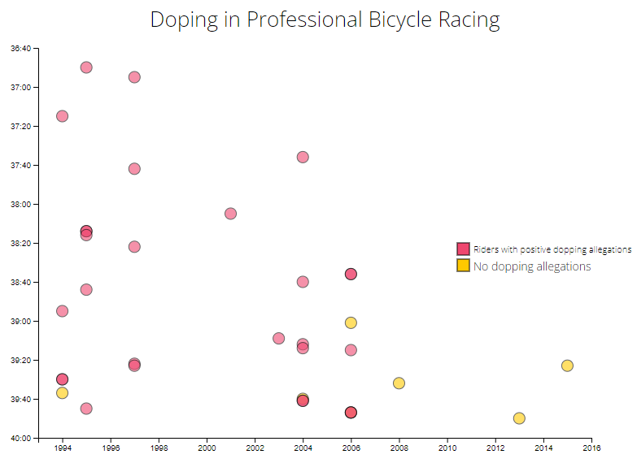
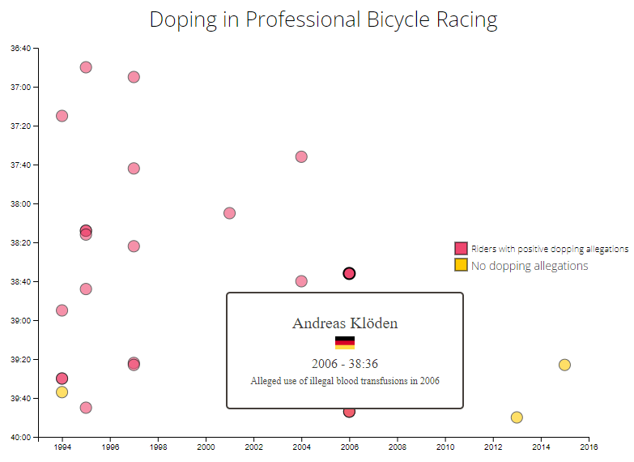

# Visualize Data with a Scatterplot Graph

- This D3 graph allows you to visualize data with a scatterplot graph.

Technologies used: Javascript, D3

# Live Version

# Requirements

- I can see a title element that has a corresponding id="title".
- I can see an x-axis that has a corresponding id="x-axis".
- I can see a y-axis that has a corresponding id="y-axis".
- I can see dots, that each have a class of dot, which represent the data being plotted.
- Each dot should have the properties data-xvalue and data-yvalue containing their corresponding x and y values.
- The data-xvalue and data-yvalue of each dot should be within the range of the actual data and in the correct data format. For data-xvalue, integers (full years) or Date objects are acceptable for test evaluation. For data-yvalue (minutes), use Date objects.
- The data-xvalue and its corresponding dot should align with the corresponding point/value on the x-axis.
- The data-yvalue and its corresponding dot should align with the corresponding point/value on the y-axis.
- I can see multiple tick labels on the y-axis with %M:%S time format.
- I can see multiple tick labels on the x-axis that show the year.
- I can see that the range of the x-axis labels are within the range of the actual x-axis data.
- I can see that the range of the y-axis labels are within the range of the actual y-axis data.
- I can see a legend containing descriptive text that has id="legend".
- I can mouse over an area and see a tooltip with a corresponding id="tooltip" which displays more information about the area.
- My tooltip should have a data-year property that corresponds to the data-xvalue of the active area.